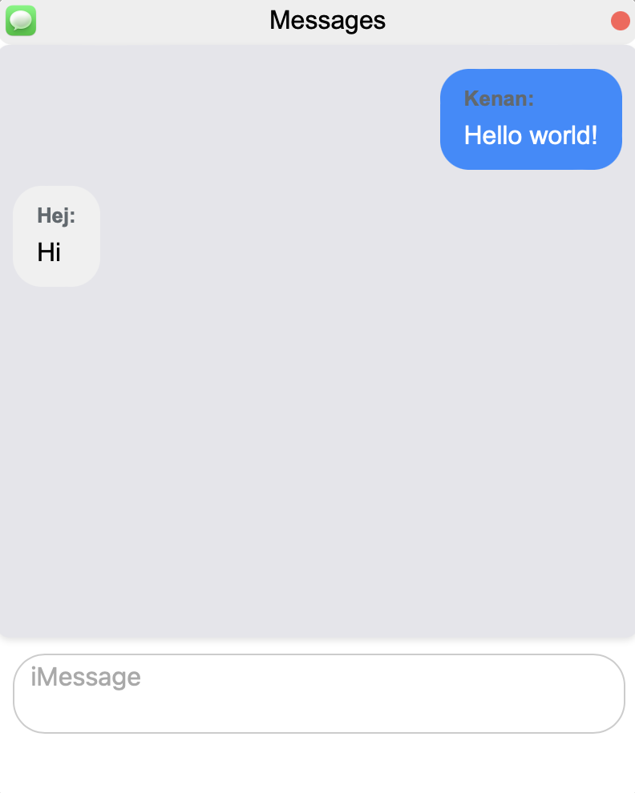

GitHub Copilot: # Project Title

This project is a simple desktop-like interface in the browser where you can open and interact with different applications like a Memory Game, a Chat application, a YouTube player, and a Task Manager.

## Getting Started

To get a local copy up and running, follow these simple steps.

### Prerequisites

This project runs in the browser, so no special prerequisites are required.

### Installation

1. Clone the repo
   ```sh
   git clone https://github.com/your_username_/Project-Name.git
   ```
2. Open `index.html` in your browser

## Usage

### Desktop
Click on the icons on the desktop to open the corresponding application. You can drag the windows around and close them.

### Memory game

The Memory Game is a classic card game where the objective is to find and match pairs of cards. 

#### How to Play

1. Click on the Memory Game icon to start the game.
2. You will be prompted to choose the size of the game grid (options include 2x2, 2x4, and 4x4).
3. Once the game grid is displayed, click on a card to reveal its image.
4. Try to find the matching card by clicking on another card.
5. The game continues until all pairs have been found.

#### Features

- The game counts the number of attempts it takes to find all pairs and displays this number when the game is finished.
- Sound effects are played when cards are flipped and when pairs are found.
- The game can be reset at the end by clicking the "Reset Game" button.
- The game can also be played using the keyboard. Press tab once to focus on the game grid, then use the arrow keys to navigate between cards. Press space or enter to flip a card.

### Chat Application

The chat application mimics the iMessage interface, displaying chat bubbles in different positions and colors based on whether the message was sent or received. It also includes sound effects for sending and receiving messages.

#### How to Use

1. Click on the Messages icon to start the chat application.
2. If a username is stored in the local storage, the chat will initialize. If not, you will be prompted to enter a username. This username will be stored in the local storage for future sessions.
3. Once the chat is initialized, you can type messages into the input field and press the "Send" button to send them. Messages you send will appear on the right side of the chat interface in blue bubbles.
4. Messages received from others will appear on the left side of the chat interface in gray bubbles.
5. Sound effects will play when messages are sent and received.

#### Features

- The chat interface is styled to mimic iMessage, with chat bubbles appearing in different positions and colors based on whether the message was sent or received.
- Sound effects play when messages are sent and received to enhance the user experience.
- The chat application uses a WebSocket connection to send and receive messages in real time.
- The application stores the username in the local storage, so you don't have to enter it every time you open the chat.
- The chat interface includes a message display area, a message input field, and a send button. The message display area automatically updated to show new messages.
- The application keeps track of the last 20 messages and displays them in the message display area.

## Task Manager

The task manager provides an overview of all currently open windows in the application, grouped by their respective applications. It allows users to close individual windows or all windows of a specific application at once.

### How to Use

1. Click on the Task Manager icon to open the task manager.
2. The task manager interface displays a list of all open windows, grouped by application. Each group shows the name of the application and the number of open windows.
3. Clicking on the name of an application will expand or collapse the list of open windows for that application.
4. Each window in the list has a "Close" button that can be used to close the individual window.
5. Each application group also has a "Close All" button that can be used to close all windows of that application.

### Features

- The task manager automatically updates every second to reflect the current state of the application.
- The task manager groups open windows by application, making it easy to see how many windows each application has open.
- The task manager allows users to close individual windows or all windows of a specific application at once.
- The task manager remembers the expanded/collapsed state of each application group, so if a group was expanded the last time the task manager was updated, it will remain expanded 
in the next update.

## YouTube Player

The YouTube player allows users to load and play YouTube videos within the application.

### How to Use

1. Click on the YouTube Player icon to open the YouTube player.
2. Enter a YouTube video URL into the input field.
3. Click the "Load Video" button to load the video. The video will be displayed in an iframe below the input field and button.

### Features

- The YouTube player supports any YouTube video URL. It extracts the video ID from the URL and uses it to load the video.
- The YouTube player uses an iframe to display the video, allowing users to watch the video without leaving the application.
- The iframe is initially hidden and is only displayed once a video is loaded.
- The YouTube player supports all standard YouTube video features, including autoplay, encrypted media, gyroscope, and picture-in-picture.
- The YouTube player also supports fullscreen mode (although outside of the PWD)

## Screenshots

Here are some screenshots of the application:

### Desktop


The desktop interface with application icons.

### Memory Game


The Memory Game application.

### Chat Application



The Chat application.

### Task Manager


The Task Manager application.

### YouTube Player


The YouTube Player application.

## Code Overview

The main script (`script.js`) listens for the `DOMContentLoaded` event and then sets up event listeners on the application icons. When an icon is clicked, it opens the corresponding application in a new window.

The windows can be dragged around the desktop and closed. The position of each new window is calculated based on the position of the last window.

## NOTE
All images are owned by me except for the messages icon, desktop background and sound files for messages. All of these are from macOS, and are used purely for educational purposes (fair use). It is to style it to look like macOS running in a browser.